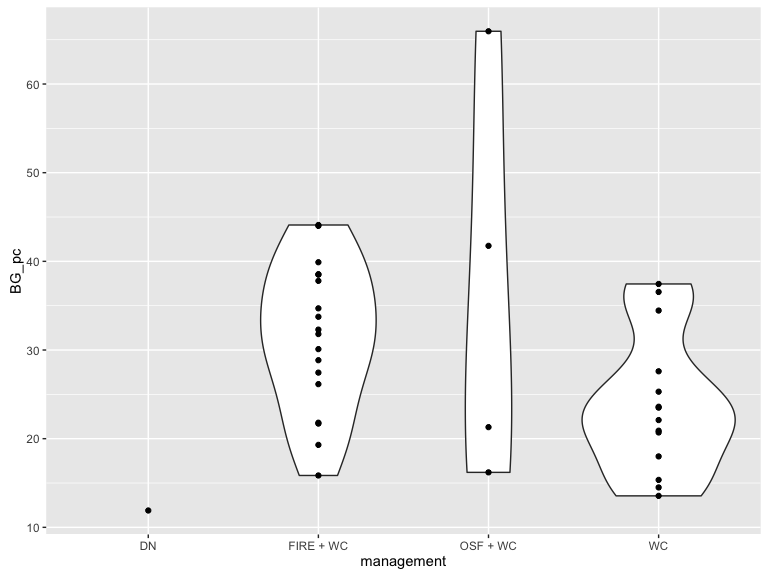
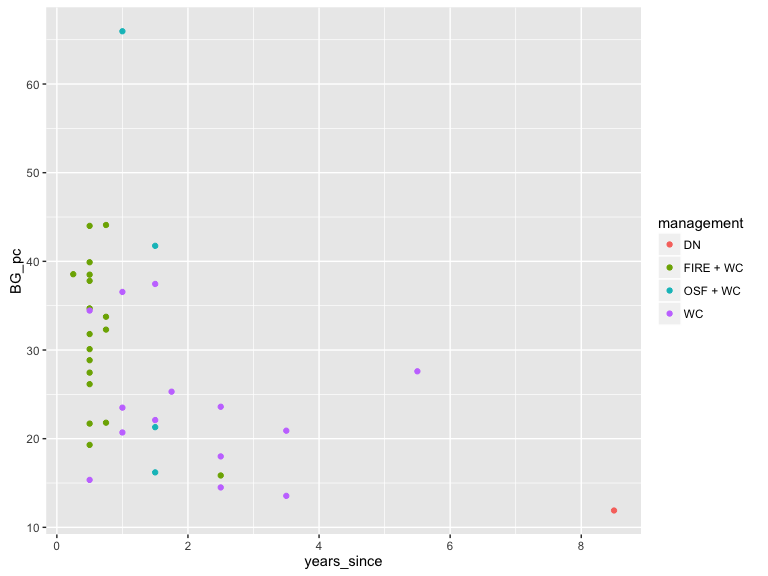
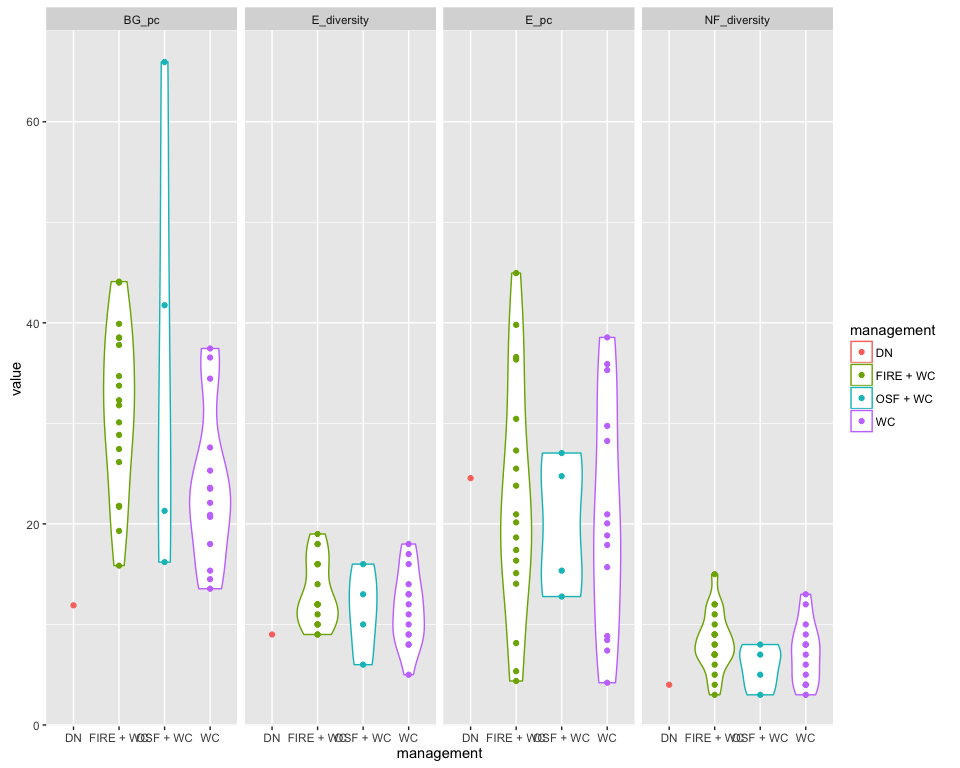

Wrangling your data frames with dplyr and tidyr
================
Elise Gould
6 September 2016

Why dplyr?
==========

Anything you can do in dplyr, you can do in base R. So why bother?

Expressive, and verb-focused rather than object-focused:

-   Code is easier to write: less mental effort, more efficient (I have been able to halve the number of lines of code taken to merge and tidy data-frames when translating into dplyr).
-   this means it's easy to *read*, which is handy if you're reading other people's code, or some code from a project you haven't looked at in a while.

Computationally efficient:

Many operations are coded in C++, so commands are very fast to execute.

A grammar of data manipulation:
===============================

*Verbs*:
--------

-   row-wise subsetting: `filter()` takes logical conditions as arguments
-   column-wise subsetting: `select()` takes column names or `tidyr` functions to select matching columns

-   Create new variables, change existing variables: `mutate()`
-   summarise data with summary statistics: `summarise()`

-   Reorder rows: `arrange()`
-   Rename variables: `rename()`

-   Writing sentences, connecting your verbs: `%>%` pipe operator for connecting each operation into a pipeline.

A common syntax:
----------------

Each of the verbs above follow the same syntax:

-   first argument is a data-frame
-   other arguments describe what to do to that data frame, you refer to columns in the data frame directly, no need to use the $ operator
-   the function returns a new data frame
-   input and output dataframes are *tidy* dataframes

Manipulating ecological data with `dplyr`: a demo
=================================================

About the dataset we'll be using:
---------------------------------

This is the field data from my Master's project. Check out the github repository here: [GrasslandAllocatr](https://github.com/egouldo/GrasslandAllocatr).

1.  There is one file containing the raw observations from the field campaign.
2.  A second file containing information about all observed vascular species across all sites
3.  A third file containing information about management actions undertaken at each site.

Planning ahead: what do we want to do with this data?
-----------------------------------------------------

We establish the aims of the mini-analysis:

1.  Import and merge the three datasets into a single data frame.
2.  Create new variables summarised over each transect - mean bare ground per transect - mean exotic cover per transect - weed diversity at each transect - native forb diversity at each transect
3.  Do some plotting with our tidy, summarised data

Get the data:
-------------

``` r
# devtools::install_github("egouldo/GrasslandAllocatr") # uncomment to download the data
library(GrasslandAllocatr)
data("field_data_raw_2014")
data("field_site_management_2014")
data("field_species_lookup_table_2014")
```

Let's check out the structure of the data, there are three data frames:

``` r
dplyr::glimpse(field_data_raw_2014)
```

    ## Observations: 5,098
    ## Variables: 1
    ## $ transect_number.quadrat.species.percent_cover <fctr> 1,1,vulpia brom...

``` r
glimpse(field_site_management_2014)
```

    ## Observations: 38
    ## Variables: 1
    ## $ transect_number.size.date.orientation.assistant.management.burn_season.years_since.biomass_reduction_year.management_unit <fctr> ...

``` r
glimpse(field_species_lookup_table_2014)
```

    ## Observations: 167
    ## Variables: 1
    ## $ species.origin.growth_form.type <fctr> acaena echinata,N,F,NF, acaen...

Tidying our data
----------------

Oh-oh, data was stored incorrectly, and the columns have been merged together... let's fix that:

``` r
field_data <- field_data_raw_2014 %>% 
        tidyr::separate(., 
                        col = transect_number.quadrat.species.percent_cover, 
                        into = c("transect_number", "quadrat", "species", "percent_cover"),
                        sep = ",")  %>% tbl_df()

field_data # neat console output from tbl_df
```

    ## # A tibble: 5,098 × 4
    ##    transect_number quadrat                   species percent_cover
    ## *            <chr>   <chr>                     <chr>         <chr>
    ## 1                1       1          vulpia bromoides          15.0
    ## 2                1       1               briza minor          15.0
    ## 3                1       1         aira caryophyllea           0.5
    ## 4                1       1             romulea rosea           0.5
    ## 5                1       1         bromus hordeaceus           3.0
    ## 6                1       1 convolvulus angustissimus           1.0
    ## 7                1       1         solenogyne gunnii           5.0
    ## 8                1       1      calocephalus citreus           5.0
    ## 9                1       1     plantago gaudichaudii           5.0
    ## 10               1       1          oxalis perennans           0.5
    ## # ... with 5,088 more rows

``` r
glimpse(field_data) # That's better
```

    ## Observations: 5,098
    ## Variables: 4
    ## $ transect_number <chr> "1", "1", "1", "1", "1", "1", "1", "1", "1", "...
    ## $ quadrat         <chr> "1", "1", "1", "1", "1", "1", "1", "1", "1", "...
    ## $ species         <chr> "vulpia bromoides", "briza minor", "aira caryo...
    ## $ percent_cover   <chr> "15.0", "15.0", "0.5", "0.5", "3.0", "1.0", "5...

``` r
site_management_data <- field_site_management_2014 %>%
        tidyr::separate(.,
                        col = transect_number.size.date.orientation.assistant.management.burn_season.years_since.biomass_reduction_year.management_unit,
                        into = c("transect_number", "size", "date", "orientation", 
                                 "assistant", "management", "burn_season", "years_since", 
                                 "biomass_reduction_year", "management_unit") ,sep = ",") %>% tbl_df()

glimpse(site_management_data) # That's better
```

    ## Observations: 38
    ## Variables: 10
    ## $ transect_number        <chr> "1", "2", "3", "4", "5", "6", "7", "8",...
    ## $ size                   <chr> "0.43", "0.5", "3.34", "0.465", "0.465"...
    ## $ date                   <chr> "2014-10-27", "2014-10-27", "2014-10-27...
    ## $ orientation            <chr> "132 SE", "119 SE", "230 SW", "290 W", ...
    ## $ assistant              <chr> "HP", "HP", "HP", "HP", "HP", "HP", "VH...
    ## $ management             <chr> "FIRE + WC", "FIRE + WC", "WC", "WC", "...
    ## $ burn_season            <chr> "summer", "summer", "autumn", "autumn",...
    ## $ years_since            <chr> "0.75", "0.75", "1.5", "2.5", "2.5", "3...
    ## $ biomass_reduction_year <chr> "2014", "2014", "2013", "2012", "2012",...
    ## $ management_unit        <chr> "1", "2", "3", "4", "5", "6", "7", "8",...

``` r
species_lookup_table <- field_species_lookup_table_2014 %>%
        tidyr::separate(., 
                        col = species.origin.growth_form.type ,
                        into = c("species", "origin", "growth_form", "type"), sep = ",") %>% tbl_df()

glimpse(species_lookup_table) # That's better
```

    ## Observations: 167
    ## Variables: 4
    ## $ species     <chr> "acaena echinata", "acaena novae-zelandiae", "acae...
    ## $ origin      <chr> "N", "N", "N", "N", "E", "E", "E", "E", "N", "E", ...
    ## $ growth_form <chr> "F", "F", "F", "F", "NA", "NA", "NA", "NA", "G", "...
    ## $ type        <chr> "NF", "NF", "NF", "NF", "E", "E", "E", "E", "NG", ...

So we have three different data frames now:

1.  `field_data`: 38 transects, and 10 quadrats per each transect. For each quadrat we have percentage cover estimates for individual species, as well as abiotic variables including litter, rock, lichen and bare ground. Note that the variable `species` is a bit of a misnomer because this column contains species names and abiotic variables.
2.  `site_management_data`: Contains information about management actions undertaken at each site, and any burning history, such as date and season of last burn (an observation for each transect)
3.  `species_lookup_data`: Contains a list of every single vascular species observed across all sites, and the origin (native, exotic), growth form (forb, graminoid).

Merging data frames: relational data
------------------------------------

We want to keep all observations in the `field_data` frame, and we want to add the columns from the `species_lookup_dataframe`, matching by each species. So we want a `left_join()`, which can be graphically represented by:


See the section on relational data frames in Wickham and Grolemund's book [R for datascience](http://r4ds.had.co.nz/relational-data.html) for more information about the different types of joins in `dplyr`.

We also want to merge in site-level management attributes. We'll do the joining in two-steps, and connect them with a pipe.

``` r
analysis_data <- dplyr::left_join(field_data, species_lookup_table) %>% # this weird operator is a pipe
        dplyr::left_join(.,site_management_data)
```

    ## Joining, by = "species"

    ## Joining, by = "transect_number"

``` r
analysis_data # after
```

    ## # A tibble: 5,098 × 16
    ##    transect_number quadrat                   species percent_cover origin
    ##              <chr>   <chr>                     <chr>         <chr>  <chr>
    ## 1                1       1          vulpia bromoides          15.0      E
    ## 2                1       1               briza minor          15.0      E
    ## 3                1       1         aira caryophyllea           0.5      E
    ## 4                1       1             romulea rosea           0.5      E
    ## 5                1       1         bromus hordeaceus           3.0      E
    ## 6                1       1 convolvulus angustissimus           1.0      N
    ## 7                1       1         solenogyne gunnii           5.0      N
    ## 8                1       1      calocephalus citreus           5.0      N
    ## 9                1       1     plantago gaudichaudii           5.0      N
    ## 10               1       1          oxalis perennans           0.5      N
    ## # ... with 5,088 more rows, and 11 more variables: growth_form <chr>,
    ## #   type <chr>, size <chr>, date <chr>, orientation <chr>,
    ## #   assistant <chr>, management <chr>, burn_season <chr>,
    ## #   years_since <chr>, biomass_reduction_year <chr>, management_unit <chr>

``` r
glimpse(analysis_data) # this is where glimpse comes in handy...
```

    ## Observations: 5,098
    ## Variables: 16
    ## $ transect_number        <chr> "1", "1", "1", "1", "1", "1", "1", "1",...
    ## $ quadrat                <chr> "1", "1", "1", "1", "1", "1", "1", "1",...
    ## $ species                <chr> "vulpia bromoides", "briza minor", "air...
    ## $ percent_cover          <chr> "15.0", "15.0", "0.5", "0.5", "3.0", "1...
    ## $ origin                 <chr> "E", "E", "E", "E", "E", "N", "N", "N",...
    ## $ growth_form            <chr> "NA", "NA", "NA", "NA", "NA", "F", "F",...
    ## $ type                   <chr> "E", "E", "E", "E", "E", "NF", "NF", "N...
    ## $ size                   <chr> "0.43", "0.43", "0.43", "0.43", "0.43",...
    ## $ date                   <chr> "2014-10-27", "2014-10-27", "2014-10-27...
    ## $ orientation            <chr> "132 SE", "132 SE", "132 SE", "132 SE",...
    ## $ assistant              <chr> "HP", "HP", "HP", "HP", "HP", "HP", "HP...
    ## $ management             <chr> "FIRE + WC", "FIRE + WC", "FIRE + WC", ...
    ## $ burn_season            <chr> "summer", "summer", "summer", "summer",...
    ## $ years_since            <chr> "0.75", "0.75", "0.75", "0.75", "0.75",...
    ## $ biomass_reduction_year <chr> "2014", "2014", "2014", "2014", "2014",...
    ## $ management_unit        <chr> "1", "1", "1", "1", "1", "1", "1", "1",...

Let's *tidy* up a bit:
----------------------

### Remove rows using `dplyr::filter()` and cols using `dplyr::select()`

I want to exclude the site that has been slashed from further analysis, we do this with `dplyr::filter()`. I don't really care about the `origin` or `growth_form` variables, because `type` is an amalgam of these two variables for vascular species, but contains entries for abiotic measures like rock and bare-ground, which is also important. Let's drop this using `dplyr::select()`. We can join both of these two operations together into a pipeline, using the pipe operator `%>%`.

``` r
analysis_data %<>% 
        dplyr::filter(management != "Slashing_WC") %>%
        dplyr::select(-growth_form,-origin)
analysis_data %>% glimpse
```

    ## Observations: 4,977
    ## Variables: 14
    ## $ transect_number        <chr> "1", "1", "1", "1", "1", "1", "1", "1",...
    ## $ quadrat                <chr> "1", "1", "1", "1", "1", "1", "1", "1",...
    ## $ species                <chr> "vulpia bromoides", "briza minor", "air...
    ## $ percent_cover          <chr> "15.0", "15.0", "0.5", "0.5", "3.0", "1...
    ## $ type                   <chr> "E", "E", "E", "E", "E", "NF", "NF", "N...
    ## $ size                   <chr> "0.43", "0.43", "0.43", "0.43", "0.43",...
    ## $ date                   <chr> "2014-10-27", "2014-10-27", "2014-10-27...
    ## $ orientation            <chr> "132 SE", "132 SE", "132 SE", "132 SE",...
    ## $ assistant              <chr> "HP", "HP", "HP", "HP", "HP", "HP", "HP...
    ## $ management             <chr> "FIRE + WC", "FIRE + WC", "FIRE + WC", ...
    ## $ burn_season            <chr> "summer", "summer", "summer", "summer",...
    ## $ years_since            <chr> "0.75", "0.75", "0.75", "0.75", "0.75",...
    ## $ biomass_reduction_year <chr> "2014", "2014", "2014", "2014", "2014",...
    ## $ management_unit        <chr> "1", "1", "1", "1", "1", "1", "1", "1",...

The pipe operator sends the object on the left as the first argument to the commands on the right. We can chain multiple operations together with multiple pipes. The `%<>%` is a special version of the pipe operator from package `magrittr`, it sends the transformed object back and assigns it to the object's name, in this case `analysis_data`

### Change existing variables using `dplyr::mutate()`

Unfortunately there was no information about non-vascular species in the 'type' column that came from the `species_lookup_table` dataframe. We want information about the type of every recorded entity in each quadrat in this column. So far we only have information about vascular plants.

We use `dplyr::mutate` to manipulate existing variables. We can incorporate `ifelse` statements to assign the output to the column we want to manipulate conditionally. Below we want to set the type to "bare ground" or `"BG"` if there is an observation of "BG" in the `species` column.

``` r
analysis_data %<>%
        dplyr::mutate(type = ifelse(species == "BG", "BG", type),
                      type = ifelse(species == "L", "L", type),
                      type = ifelse(species == "LM", "LM", type),
                      type = ifelse(species == "R", "R", type))
```

Also, when we loaded our dataframes in from the package, all variables were stored as character variables. We want to change the following variables to:

1.  `percent_cover` -&gt; double
2.  `size` -&gt; double
3.  `date` -&gt; date-format
4.  `management` -&gt; factor
5.  `years_since` last biomass removal -&gt; double
6.  `transect_number` and `quadrat` -&gt; integer

Again, we manipulate existing variables using `dplyr::mutate`

``` r
analysis_data %<>%
        dplyr::mutate(percent_cover = as.double(percent_cover),
                      size = as.double(size),
                      date = lubridate::as_date(date),
                      management = as.factor(management),
                      years_since = as.double(years_since),
                      transect_number = as.integer(transect_number),
                      quadrat = as.integer(quadrat))
```

Now let's *transform* our data:
-------------------------------

We want to create following summary variables, one for every single transect:

-   `BG_pc` Mean percent cover of bare-ground (`type == "BG`"), for each transect
-   `E_pc` Mean percent cover of all exotic species (`type == "E`), for each transect
-   `E_diversity` Number of all exotic species at each transect (sum of all `"E"` spp across quadrats)
-   `NF_diversity` Number of native forbs (`type == "BG"`)

### Grouped operations with `dplyr::group_by()`:

The `dplyr::group_by` function is the star of the show here, and we can avoid for-loops when we want to repeat the same operation on subsets or groups of a dataframe. This is particularly handy when we have nested grouping.

For example, the first two variables we want to create require that we `group_by` each transect, *then* each quadrat, *then* each type. The second set of variables require that we group by `transect` and `type` only: we want to know how many unique species occurred in each transect, for both exotic and native forbs.

We'll create each type of variable separately, starting with the percent cover variables:

``` r
analysis_data %>%
        dplyr::group_by(transect_number, quadrat, type) %>%
        dplyr::summarise(pc_type = sum(percent_cover)) # Gives us the percent cover for each type, in each quadrat
```

    ## Source: local data frame [1,980 x 4]
    ## Groups: transect_number, quadrat [?]
    ## 
    ##    transect_number quadrat  type pc_type
    ##              <int>   <int> <chr>   <dbl>
    ## 1                1       1    BG    14.5
    ## 2                1       1     E    34.0
    ## 3                1       1     L     2.0
    ## 4                1       1    NF    16.5
    ## 5                1       1    NG    35.5
    ## 6                1       2    BG    10.5
    ## 7                1       2     E    56.0
    ## 8                1       2     L     0.5
    ## 9                1       2    NF    15.5
    ## 10               1       2    NG    18.0
    ## # ... with 1,970 more rows

``` r
# now we want to take the mean of the type percent cover totals, over all quadrats, let's try again:
mean_percent_cover <- 
        analysis_data %>%
        group_by(transect_number, quadrat, type) %>%
        summarise(pc_type = sum(percent_cover)) %>%
        group_by(transect_number,type) %>%
        summarise(mean_pc_type = mean(pc_type))

mean_percent_cover
```

    ## Source: local data frame [233 x 3]
    ## Groups: transect_number [?]
    ## 
    ##    transect_number  type mean_pc_type
    ##              <int> <chr>        <dbl>
    ## 1                1    BG    32.300000
    ## 2                1     E    17.400000
    ## 3                1     L     1.777778
    ## 4                1    LM     0.500000
    ## 5                1    NF    21.450000
    ## 6                1    NG    28.750000
    ## 7                2    BG    33.750000
    ## 8                2     E    36.600000
    ## 9                2     L     0.500000
    ## 10               2    NF     6.000000
    ## # ... with 223 more rows

``` r
# But we only want the mean percent cover for the exotic species, and the native forbs:
# AND, we want them to be in separate columns.

mean_percent_cover %<>%
        tidyr::spread(., key = type, value = mean_pc_type) %>%
        select(transect_number, BG, E) %>%
        dplyr::rename(., E_pc = E, BG_pc = BG)

mean_percent_cover
```

    ## Source: local data frame [37 x 3]
    ## Groups: transect_number [37]
    ## 
    ##    transect_number BG_pc   E_pc
    ## *            <int> <dbl>  <dbl>
    ## 1                1 32.30 17.400
    ## 2                2 33.75 36.600
    ## 3                3 37.45 20.950
    ## 4                4 14.50 15.700
    ## 5                5 18.00  8.450
    ## 6                6 20.90  7.400
    ## 7                7 20.70 35.300
    ## 8                8 65.95 12.775
    ## 9                9 44.10  5.350
    ## 10              10 38.55  4.375
    ## # ... with 27 more rows

Okay, onto the diversity variables now:

``` r
# Let's get the number of distinct species of Ecotics and Native Forbs, within each transect
diversity_vars <-
        analysis_data %>%
        filter(type == "NF" | type == "E") %>%
        group_by(transect_number, type) %>%
        distinct(species) %>%
        tally

# Let's get this into an appropriate shape for joining this onto the percent cover data:
diversity_vars
```

    ## Source: local data frame [74 x 3]
    ## Groups: transect_number [?]
    ## 
    ##    transect_number  type     n
    ##              <int> <chr> <int>
    ## 1                1     E    12
    ## 2                1    NF    12
    ## 3                2     E    12
    ## 4                2    NF     7
    ## 5                3     E    16
    ## 6                3    NF    10
    ## 7                4     E     5
    ## 8                4    NF     4
    ## 9                5     E     8
    ## 10               5    NF     4
    ## # ... with 64 more rows

Let's join these two data frames back together:

``` r
diversity_vars %<>%
        spread(key = type, value = n) %>%
        rename(E_diversity = E, NF_diversity = NF)
diversity_vars
```

    ## Source: local data frame [37 x 3]
    ## Groups: transect_number [37]
    ## 
    ##    transect_number E_diversity NF_diversity
    ## *            <int>       <int>        <int>
    ## 1                1          12           12
    ## 2                2          12            7
    ## 3                3          16           10
    ## 4                4           5            4
    ## 5                5           8            4
    ## 6                6           9            7
    ## 7                7          13            9
    ## 8                8           6            3
    ## 9                9           9           10
    ## 10              10          11           15
    ## # ... with 27 more rows

But wait, we're missing the site level data, which are our explanatory variables.Let's first join the two data frames containing our response variables together, and then join it back in. Notice how we can pipe each of these actions together into a single pipeline.

``` r
summary_vars <- left_join(mean_percent_cover, diversity_vars) %>%
        left_join(.,{analysis_data %>% 
                        select(transect_number,management,years_since) %>%
        distinct})
```

    ## Joining, by = "transect_number"
    ## Joining, by = "transect_number"

Our data's ready for analysis now, make some plots:
---------------------------------------------------

Because we've been 'tidying' our data as we go, we can send it straight to ggplot2, for some nice plots.

``` r
summary_vars %>%
        ggplot(aes(x = management, y = BG_pc)) +
        geom_violin() +
        geom_point()
```



``` r
summary_vars %>%
        ggplot(aes(x = years_since, y = BG_pc, colour = management)) +
        geom_point()
```



That's nice. But I wonder how each of the variables vary in relation to one another? We'll use faceting in ggplot2, so we'll need to make our data long.

``` r
summary_vars %>% 
        gather(key = variable, value = value, BG_pc,E_pc,E_diversity,NF_diversity) %>%
        ggplot(aes(x = management, y = value, colour = management)) +
        geom_violin() +
        geom_point()+
        facet_grid(.~variable)
```



That's all folks!

Session Info:
=============

``` r
sessionInfo()
```

    ## R version 3.3.0 (2016-05-03)
    ## Platform: x86_64-apple-darwin13.4.0 (64-bit)
    ## Running under: OS X 10.11.6 (El Capitan)
    ## 
    ## locale:
    ## [1] en_AU.UTF-8/en_AU.UTF-8/en_AU.UTF-8/C/en_AU.UTF-8/en_AU.UTF-8
    ## 
    ## attached base packages:
    ## [1] stats     graphics  grDevices utils     datasets  methods   base     
    ## 
    ## other attached packages:
    ## [1] GrasslandAllocatr_0.0.9008 ggplot2_2.1.0             
    ## [3] devtools_1.12.0            tidyr_0.6.0               
    ## [5] dplyr_0.5.0                magrittr_1.5              
    ## 
    ## loaded via a namespace (and not attached):
    ##  [1] Rcpp_0.12.6      knitr_1.14       munsell_0.4.3    colorspace_1.2-6
    ##  [5] R6_2.1.3         stringr_1.1.0    plyr_1.8.4       tools_3.3.1     
    ##  [9] grid_3.3.1       data.table_1.9.6 gtable_0.2.0     DBI_0.5         
    ## [13] withr_1.0.2      htmltools_0.3.5  lazyeval_0.2.0   rprojroot_1.0-2 
    ## [17] yaml_2.1.13      assertthat_0.1   digest_0.6.10    tibble_1.2      
    ## [21] reshape2_1.4.1   formatR_1.4      memoise_1.0.0    evaluate_0.9    
    ## [25] rmarkdown_1.0    labeling_0.3     stringi_1.1.1    scales_0.4.0    
    ## [29] lubridate_1.5.6  chron_2.3-47
